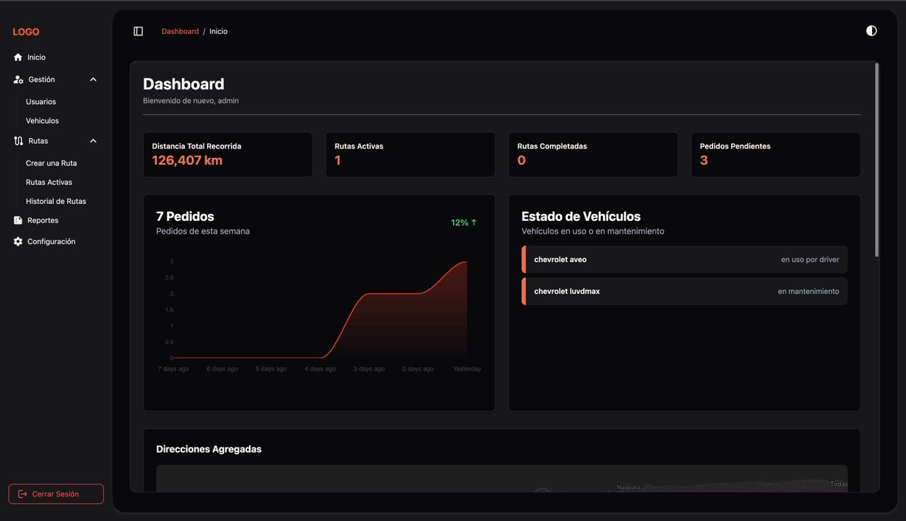
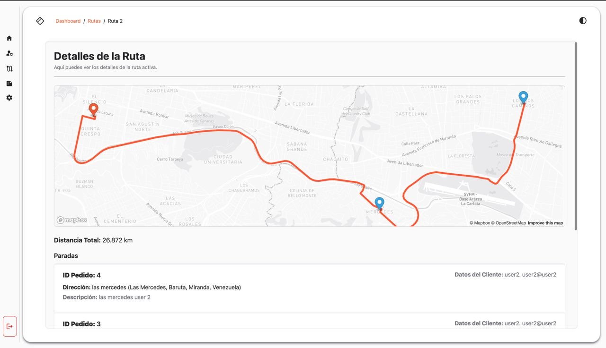

# Sistema de Optimización de Rutas para Entregas

Este sistema fue desarrollado para gestionar rutas de entrega de forma eficiente utilizando un [algoritmo de optimización implementado en Python](https://github.com/dylan-tovar/sistema-rutas-api). Proporciona un panel de control completo para monitorear rutas activas, pedidos, estado de los vehículos y datos históricos. Está construido con Laravel y TailwindCSS, y utiliza Mapbox para la visualización en tiempo real de las rutas.

  

---

## 🚀 Funcionalidades

- 📦 Gestión y seguimiento de pedidos semanales
- 🚗 Monitoreo del estado de los vehículos (en uso o en mantenimiento)
- 📍 Visualización de rutas en tiempo real con Mapbox
- 🔄 Optimización automática de rutas a través de una API externa en Python
- 📊 Dashboard con estadísticas de distancia total recorrida y pedidos activos, completados o pendientes
- 🧭 Detalle de cada parada con información del pedido y del cliente
- 👤 Sistema de roles con vistas y permisos personalizados para cada tipo de usuario

---

## 🧱 Sistema de Roles

- **Administrador:** Acceso total al sistema (usuarios, vehículos, rutas, reportes, etc.)
- **Usuario:** Puede registrar y hacer seguimiento de sus pedidos
- **Conductor:** Accede a las rutas asignadas y actualiza el estado de las entregas

Cada rol cuenta con su propia interfaz y permisos específicos.

---

## 🛠 Tecnologías Utilizadas

- **Backend:** Laravel (PHP)
- **Frontend:** Blade + TailwindCSS
- **Mapas y Rutas:** Mapbox + OpenStreetMap
- **Optimización de Rutas:** [Microservicio en Python con Google OR-Tools (VRP)](https://github.com/dylan-tovar/sistema-rutas-api)
- **Base de Datos:** MySQL (contenedor Docker)

---

## 🧠 Optimización de Rutas

El sistema utiliza el algoritmo **Vehicle Routing Problem (VRP)** de [Google OR-Tools](https://developers.google.com/optimization/routing/vrp), implementado como una [API en Python](https://github.com/dylan-tovar/sistema-rutas-api). Esta API recibe los pedidos y sus direcciones, y devuelve la ruta más eficiente considerando distancias. El sistema está preparado para incluir restricciones adicionales como capacidad de vehículos o ventanas de tiempo, si se desea extender.

---

## 📸 Capturas de Pantalla

### Panel de Control
Muestra estadísticas globales como la distancia total recorrida, pedidos semanales y estado de vehículos.


### Detalles de la Ruta
Visualiza el recorrido completo en el mapa, las paradas de entrega y los datos de los clientes.



---

## 📂 Estructura del Proyecto

```plaintext
.
├── app
│   ├── Http
│   │   ├── Controllers
│   │   └── Middleware
│   ├── Models
│   ├── Providers
│   └── View
│       └── Components
├── bootstrap
│   └── cache
├── config
├── database
│   ├── factories
│   ├── migrations
│   └── seeders
├── public
├── resources
│   ├── css
│   ├── js
│   └── views
│       ├── components
│       ├── dashboard
│       │   ├── admin
│       │   │   ├── gestion
│       │   │   ├── reportes
│       │   │   └── rutas
│       │   ├── driver
│       │   └── user
│       │       ├── directions
│       │       └── orders
│       ├── layouts
│       ├── login
│       └── roles
└── routes
```


---

## 📄 Licencia

Este proyecto está bajo la Licencia GNU General Public License v3.0. Consulta el archivo [LICENSE](LICENSE) para más información.

